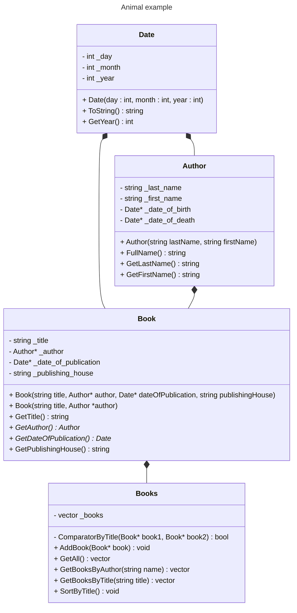

# Задание 1.
Разработайте программу "Библиотека". 
Создайте структуру "Книга" (название, автора, издательство, жанр). 
Создайте массив из 10 книг.
Реализуйте для него следующие возможности:
- Редактировать книгу;
- Печать всех книг;
- Поиск книг по автору;
- Поиск книги по названию;
- Сортировка массива по названию книг;
- Сортировка массива по автору;
- Сортировка массива по издательству.

